# Hi there, I'm Ganesh M 👋 

I am a seasoned **ML Engineer and Consultant** with over 8 years of experience in the tech industry. Currently, I am a **Consultant at Deloitte**, where I bridge the gap between RPA foundations and advanced Machine Learning/MLOps to drive automation at scale.

- 🔭 **Current Focus:** Designing and deploying cloud-native ML workflows using Azure and Databricks.
- ⚡ **Expertise:** Bridging RPA (UiPath) with production-grade ML solutions and IoT data processing.
- 🎓 **Education:** MS in CS (AI & ML) from Woolf & BE in CS from KGiSL Institute of Technology.
- ⚖️ **Interests:** Exploring the intersection of Business Law (MBL from NLSIU) and AI Ethics.

---

## 🚀 What I'm Currently Working On

### 📋 AI-Powered Regulatory Compliance Platform

An enterprise-grade full-stack regulatory compliance management system featuring AI-powered automation:

| Module | Description |
|--------|-------------|
| **🔍 ReguLens** | AI-driven regulatory document analysis and insights extraction |
| **🤖 Audit Genie** | Automated audit policy analysis and compliance checking |
| **💬 Ask LIA** | Interactive AI assistant for compliance queries |
| **📊 Nostro Forecasting** | ML-based balance predictions for banking operations |
| **🏦 KYB Workflows** | Know Your Business verification and due diligence |
| **📈 VC Deal Screening** | Investment pipeline and deal management |
| **🔐 Security Compliance** | Compliance dashboard and monitoring |

**Tech Stack:**

---

## 🧠 What I Work On

<table>
  <tr>
    <td valign="top" width="50%">
      <h4>🤖 Generative AI & LLM Applications</h4>
      <ul>
        <li>Agentic AI systems</li>
        <li>HCP intelligence assistants</li>
        <li>Prompt engineering & LLM orchestration</li>
      </ul>
      <h4>📊 Data Science & Machine Learning</h4>
      <ul>
        <li>Predictive modeling (patient switching & targeting)</li>
        <li>Feature engineering from large-scale claims data</li>
        <li>Model explainability & business insights</li>
      </ul>
    </td>
    <td valign="top" width="50%">
      <h4>🏥 Healthcare & Pharma Analytics</h4>
      <ul>
        <li>Patient journey analysis</li>
        <li>HCP targeting & alert systems</li>
        <li>Real-world data (claims, transactions)</li>
      </ul>
      <h4>🛠 Backend & AI Engineering</h4>
      <ul>
        <li>Python-based ML pipelines</li>
        <li>API-driven AI applications</li>
        <li>End-to-end AI product development</li>
      </ul>
    </td>
  </tr>
</table>

---

### 🛠️ Tech Stack & Tools

| Category | Technologies |
|:---|:---|
| **Languages** |   |
| **ML & MLOps** |     |
| **DevOps** |    |
| **Frameworks** |   |
| **RPA** |  |

---

### 🎓 Certifications & Professional Badges

| Certification | Issuer | Verification |
| :--- | :--- | :---: |
| **Azure Data Scientist Associate (DP-100)** | Microsoft | [View License](#) |
| **Databricks Certified Associate Developer** | Databricks | [View License](#) |
| **Advanced RPA Developer (UiARD)** | UiPath | [View License](#) |
| **Terraform Associate** | HashiCorp | [View License](#) |
| **Master of Business Law (MBL)** | NLSIU | [Academic Credential](#) |

#### 🏅 LinkedIn Verified Skills
   

---

### 📈 GitHub Stats

<!-- GitHub Metrics - Auto-generated by GitHub Actions -->

  

<!-- Streak Stats with Dynamic Theme -->

  <picture>
    <source media="(prefers-color-scheme: dark)" srcset="https://streak-stats.demolab.com?user=GaneshM35&theme=github-dark-blue&hide_border=true">
    <source media="(prefers-color-scheme: light)" srcset="https://streak-stats.demolab.com?user=GaneshM35&theme=default&hide_border=true">
    
  </picture>

<!-- Profile Summary Cards with Dynamic Theme -->

  <picture>
    <source media="(prefers-color-scheme: dark)" srcset="https://github-profile-summary-cards.vercel.app/api/cards/profile-details?username=GaneshM35&theme=github_dark">
    <source media="(prefers-color-scheme: light)" srcset="https://github-profile-summary-cards.vercel.app/api/cards/profile-details?username=GaneshM35&theme=default">
    
  </picture>

---

### 📂 Featured Projects

<table>
  <tr>
    <td align="center" width="33%">
      <h4>💬 VZone-Chat</h4>
      
A communication tool developed to facilitate seamless interactions.

    </td>
    <td align="center" width="33%">
      <h4>🔍 PCB Defect Detection</h4>
      
Leveraged computer vision and Azure services for industrial quality control.

    </td>
    <td align="center" width="33%">
      <h4>😴 Fatigue Monitoring</h4>
      
IoT-based solution using ML to monitor human fatigue levels.

    </td>
  </tr>
</table>

---

## 📌 Current Interests

- 🤖 Agentic AI for enterprise use cases  
- 🧬 AI in healthcare & pharma innovation  
- 📈 Freelancing & product-based AI solutions  
- 🧘 Continuous self-development (tech + mindset)

---

### 📫 Connect with me:

  
  

---

  <i>"Turning complex requirements into scalable, auditable solutions."</i>

  <picture>
    <source media="(prefers-color-scheme: dark)" srcset="https://komarev.com/ghpvc/?username=GaneshM35&color=blueviolet&style=flat-square&label=Profile%20Views">
    <source media="(prefers-color-scheme: light)" srcset="https://komarev.com/ghpvc/?username=GaneshM35&color=blue&style=flat-square&label=Profile%20Views">
    
  </picture>

